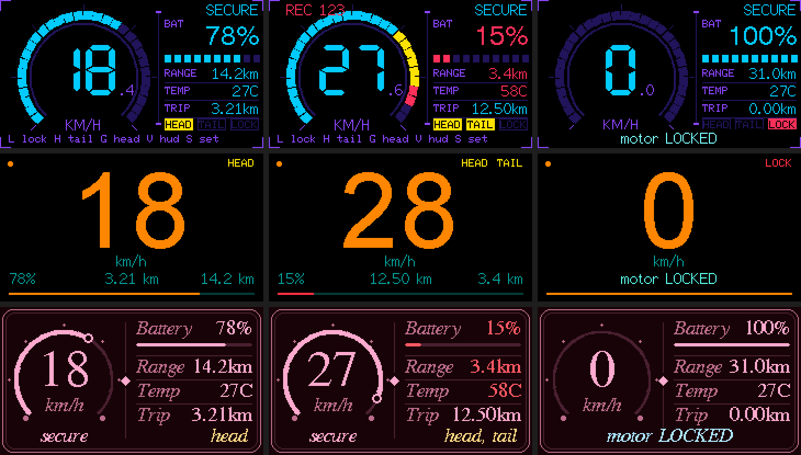

# mostly-a-Scooter
Xiaomi Pro 2 HUD and hacks for Cardputer ADV

## Themes
Press **T** (home, ride HUD, or settings) to cycle: crt, neon, orange, RED, neon-blue,
neon-purple, neon-yellow, neon-ice, pink, rosa. The choice is saved. Add your own by
appending a row to `THEMES[]` in `src/main.cpp`.

## HUD styles
Pick one in **Settings -> hud style** (`,` / `/` to change) or press **V** on the ride HUD. The choice is
saved. Every style follows the colour theme (**T**), so it is 4 styles x 13 themes.

| style | look |
| --- | --- |
| `terminal` | the original phosphor-terminal dashboard (speed scope, segmented battery bar) |
| `cyber` | futuristic: 30-segment arc gauge with an amber/red zone, tech side panel, HEAD / TAIL / LOCK tags, corner brackets |
| `minimal` | one huge speed number, a hairline battery bar, battery / trip / range in a single dim line; flags only appear when active |
| `elegant` | thin ring gauge with a glowing end-knob, serif type, double hairline frame, ornamented divider |

The gauges are full-scale at 30 km/h (`HUD_MAX_KMH`). If the serif fonts cause trouble on your
M5GFX version, build with `-DHUD_GFX_FONTS=0` to use the built-in bitmap fonts instead.

## Lights
- **H** cycles the **tail light**: off / brake / always (ESC register `0x7D`, documented).
- **G** toggles the **headlight** (also a row in Settings).

The Xiaomi headlight belongs to the dashboard assembly and, as far as I could find, no public protocol
document lists a register for it. So the headlight path is wired up end to end (key, settings row, HUD
tags, state reset on connect) but ships unconfigured: set `HEAD_ADDR`, `HEAD_REG`, `HEAD_ON` and
`HEAD_OFF` near the top of the control section of `src/main.cpp`. While `HEAD_REG` is `0` the row reads
"not set" and nothing is written to the scooter.

## Navigation
- **ESC** (top-left key) or **DEL** always goes back: Settings / battery pages -> ride HUD,
  Scan / Export -> home. ESC never disconnects; on the ride HUD **Q** still disconnects.
- **Settings** is a scrolling list: `;` / `.` move, `,` / `/` change the value, **ENT** toggles.
  Hotkeys: L lock, H tail light, G headlight, A alarm, V hud style, T theme, B beep.
